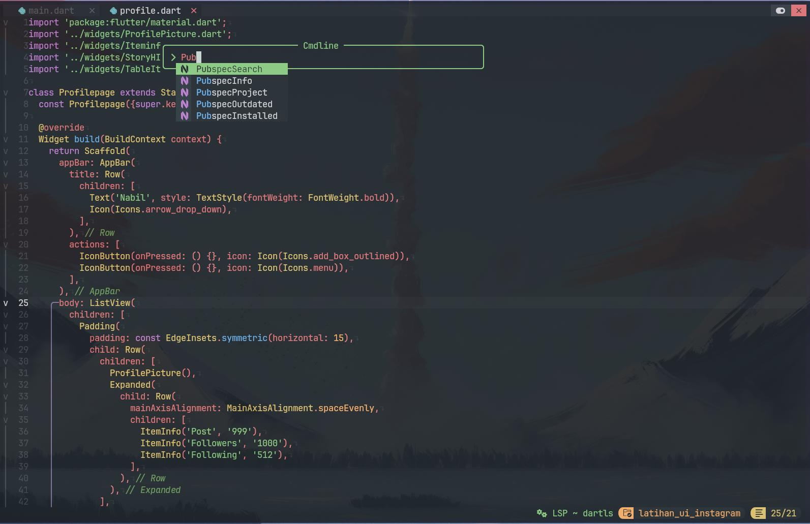
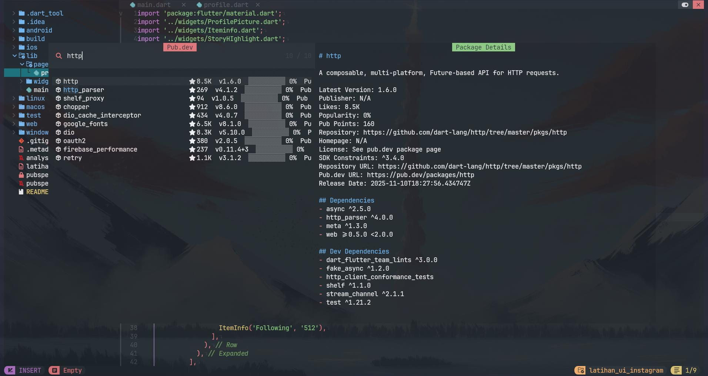
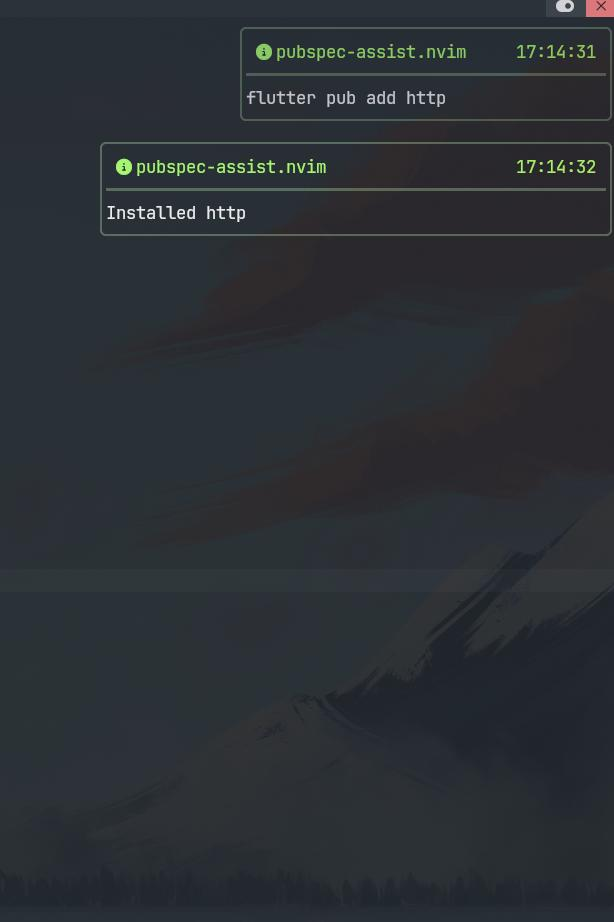
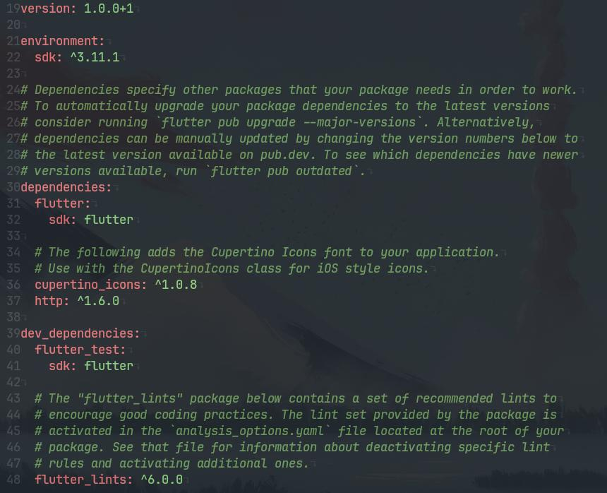

# pubspec-assist.nvim

<p align="center">
  
</p>

<h3 align="center">A fast, asynchronous Flutter package manager for Neovim.</h3>

<p align="center">
  <code>pubspec-assist.nvim</code> brings a VSCode Pubspec Assist-like workflow to Neovim, powered by Telescope, native Lua, and the pub.dev API.
</p>

<p align="center">
  <a href="https://neovim.io/"></a>
  <a href="https://flutter.dev/"></a>
  <a href="https://pub.dev/"></a>
  <a href="https://www.lua.org/"></a>
  <a href="https://github.com/nvim-telescope/telescope.nvim"></a>
  <a href="https://github.com/folke/lazy.nvim"></a>
</p>

## Overview

`pubspec-assist.nvim` is a Neovim plugin for discovering, inspecting, installing, removing, and upgrading Flutter/Dart packages directly from your editor.

It uses Telescope as the main interface, `vim.system()` for asynchronous process execution, `curl` for pub.dev requests, and a small smart cache to keep repeated searches fast and network-friendly.

## Highlights

- Live package search from `pub.dev` with `:PubspecSearch`.
- Rich Telescope result rows with package name, likes, latest version, popularity, pub points, publisher, and installed status.
- 250ms debounce for smooth typing.
- 5-minute cache for repeated queries.
- Request cancellation when the prompt changes quickly.
- Telescope preview with package metadata, dependencies, SDK constraints, URLs, release date, likes, popularity, and pub points.
- Install packages with `<CR>` using `flutter pub add`.
- Remove, upgrade, open pub.dev, copy package name, favorite, changelog, versions, and dependencies from Telescope keymaps.
- Persistent recent searches.
- Persistent favorites.
- Project dependency manager for packages already listed in `pubspec.yaml`.
- Outdated package view powered by `flutter pub outdated --json`.
- Health checks through `:checkhealth pubspec-assist`.

## Tech Stack

| Technology | Purpose | Link |
| --- | --- | --- |
| Neovim | Editor runtime | [neovim.io](https://neovim.io/) |
| Lua | Plugin language | [lua.org](https://www.lua.org/) |
| Telescope | Picker and preview UI | [telescope.nvim](https://github.com/nvim-telescope/telescope.nvim) |
| Flutter | Package install, remove, upgrade, and outdated commands | [flutter.dev](https://flutter.dev/) |
| pub.dev | Package metadata source | [pub.dev](https://pub.dev/) |
| lazy.nvim | Recommended plugin manager | [lazy.nvim](https://github.com/folke/lazy.nvim) |

## Project Structure

```text
.
|-- lua/pubspec-assist/
|   |-- init.lua        # Public plugin API
|   |-- commands.lua    # User commands
|   |-- picker.lua      # Telescope UI and action mappings
|   |-- preview.lua     # Preview rendering and floating windows
|   |-- pubdev.lua      # Async pub.dev API client
|   |-- installer.lua   # flutter pub add/remove/upgrade/outdated
|   |-- cache.lua       # TTL-based in-memory cache
|   |-- config.lua      # Defaults and setup
|   |-- utils.lua       # Shared helpers
|   `-- health.lua      # :checkhealth pubspec-assist
|-- plugin/
|   `-- pubspec-assist.lua
|-- doc/
|   `-- pubspec-assist.txt
|-- README.md
`-- LICENSE
```

## Requirements

Make sure these tools are available before installing:

- [Neovim](https://github.com/neovim/neovim/releases/latest) `0.10` or newer.
- [telescope.nvim](https://github.com/nvim-telescope/telescope.nvim).
- [curl](https://curl.se/) for pub.dev API requests.
- [Flutter SDK](https://flutter.dev/) for install, remove, upgrade, and outdated commands.
- A Nerd Font is recommended for clean package icons.

## Installation

### lazy.nvim

```lua
{
  "nabil-udah-kenyang/pubspec-assist.nvim",
  dependencies = {
    "nvim-telescope/telescope.nvim",
  },
  config = function()
    require("pubspec-assist").setup()
  end,
}
```

## Configuration

```lua
require("pubspec-assist").setup({
  debounce_ms = 250,
  cache_ttl = 300,
  max_results = 20,
  notify = true,
})
```

## Commands

| Command | Description |
| --- | --- |
| `:PubspecSearch` | Open live pub.dev package search |
| `:PubspecInstalled` | Show dependencies from `pubspec.yaml` |
| `:PubspecProject` | Open the project package manager |
| `:PubspecOutdated` | Run and display `flutter pub outdated --json` |
| `:PubspecInfo package_name` | Show package details in a floating window |
| `:checkhealth pubspec-assist` | Check plugin dependencies |

## Telescope Keymaps

| Key | Action |
| --- | --- |
| `<CR>` | Install package in search mode, open details in project mode |
| `<C-p>` | Open package page / README on pub.dev |
| `<C-l>` | Open changelog |
| `<C-v>` | Show all released versions |
| `<C-d>` | Show dependencies |
| `<C-r>` | Remove package |
| `<C-u>` | Upgrade package |
| `<C-o>` | Open the pub.dev page |
| `<C-y>` | Copy package name |
| `<C-f>` | Save to favorites |
| `i` | Open package information |
| `u` | Upgrade package |
| `r` | Remove package |
| `o` | Open the pub.dev page |

## Example Workflow

Open live search:

```vim
:PubspecSearch
```

Type a package name:

```text
http
dio
riverpod
shared_preferences
```

Press `<CR>` to install the selected package into the current Flutter project.

## Health Check

If something does not work, run:

```vim
:checkhealth pubspec-assist
```

Make sure `curl`, `flutter`, and `telescope.nvim` are detected correctly.

## Screenshots

### Command Completion

Start from Neovim's command line and access all available `pubspec-assist.nvim` commands with completion.

<p align="center">
  
</p>

### Live pub.dev Search

Search pub.dev packages directly inside Telescope. Results update as you type and the preview pane shows package metadata, dependencies, repository links, SDK constraints, and release information.

<p align="center">
  
</p>

### Async Install Feedback

Install packages with `flutter pub add` and get non-blocking Neovim notifications when the command starts and finishes.

<p align="center">
  
</p>

### pubspec.yaml Updated

After installation, the selected package is added to the project's `pubspec.yaml` dependency list.

<p align="center">
  
</p>

## Roadmap

- Dedicated favorites picker.
- Update badges based on lockfile and `flutter pub outdated`.
- Install mode for `dependencies` and `dev_dependencies`.
- Inline README rendering if pub.dev exposes stable raw README content.
- Semantic version constraint editing from Telescope.

## Contributing

Issues, feature ideas, and pull requests are welcome. The plugin is intentionally modular: API, UI, installer, cache, preview, and commands live in separate files to keep the codebase easy to extend.

## License

This project is licensed under the MIT License. See [LICENSE](./LICENSE) for details.

<p align="center">
  Built for Neovim users who want a better Flutter package workflow.
</p>

<p align="center">
  Copyright © 2026 <a href="https://github.com/nabil-udah-kenyang">nabil-udah-kenyang</a>
</p>
